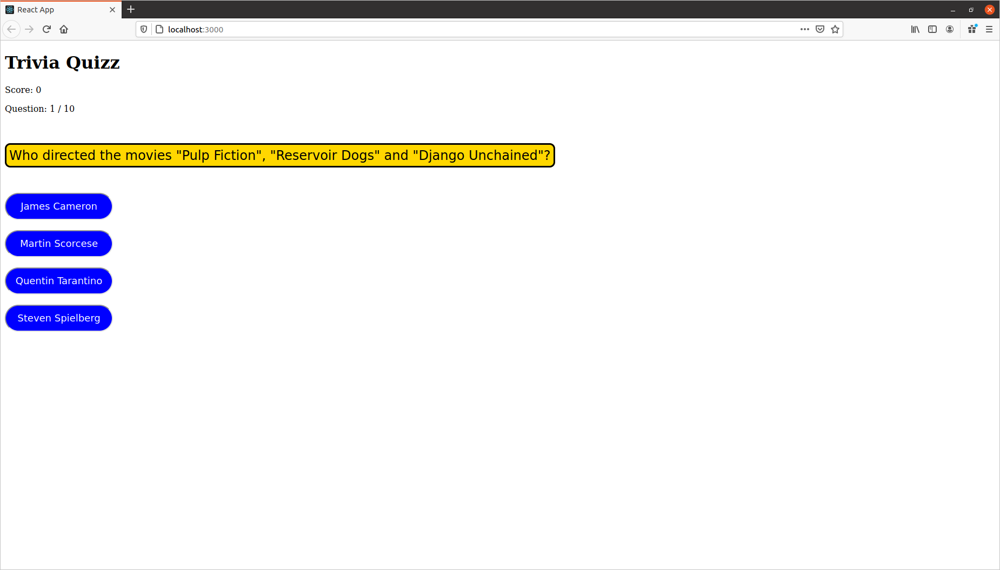
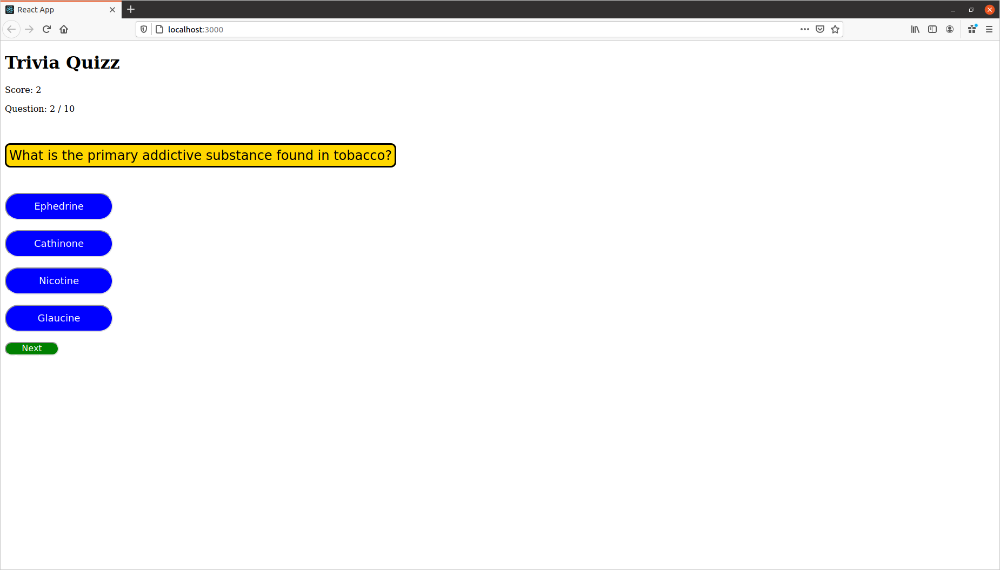
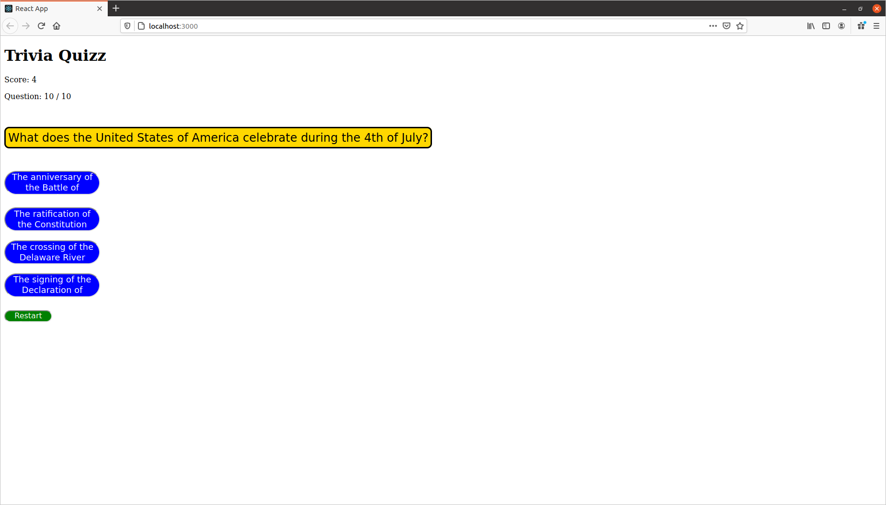

# Trivia Quizz Application (Version 1.0)

This is a simple React + TypeScript + Storybook application, when the user clicks the start button the
[Trivia API](https://opentdb.com/api_config.php) is fetched. The question and the possible answers are displayed to the user
who in turn must choose an answer.

When the answer is chosen, the score will be added by one if the answer was correct, and a next button will be shown
at the bottom to move to the next question.
When the user reaches the final question the "Next" button will turn into "Restart".

## API

Fetching and handling the data form the API

### api/quizz-api.ts

This is where the API is fetched. 
First create a **Question** type that mirrors the JSON object retreived from the API, then create another type
**QuestionExtended** where all *answers* of the trivia question exist in the same array, this makes handling the anwers
much easier. To create the new type I used *Intersection types*.

The `getQuizzData` function is returning a promise of a **QuestionExtended** array. Using the `map` function each *question*
is mapped into the same *question* however, with a new array *answers* that contains all the answers (correct and false
). This array is also shuffled, otherwise the correct answer will always be in the same position.

The shuffling is made in the following file

### utilities/shuffle-array.ts

This is a function that randomly shuffles any array.

## Components

### components/question-card.tsx

This is where the main component of the application is defined. 
The props of this component are: 

`type Props = {`

    answers: string[];

    callback: (e: React.MouseEvent<HTMLButtonElement>) => void;

    question: string;

    questionNr: number;

    userAnswer: AnswerType | undefined;

    totalQuestions: number;

`}`

- *answers* is where all the answers of each question is stored
- *callback* is called when the user clicks an answer
- *question* is the question
- *questionNr* tracks the number of the current question
- *userAnswer* is the answer provided by the user OR simply undefined in case there is no answers provided yet
- *totalQuestions* is the total number of questions fetched from the API (set manually)

The *userAnswer* is particular because it's type is also in turn a created type.

The **AnswerType** was intended to be used to display a final report for the user where they can see
their answers and whether it's correct or not, it could also be used to signal if the anser is correct or not.
In this early version it's not used as intended, rather only for keeping track if the user has answered
the current question or not.

The **QuestionCard** component is formed of other components, each of which is built using storybook. 
For each *answer* provided by the API, return a div containing a component where the user can click
a button to confirm the answer.  
If the user has given an answer, all buttons will be disabled and a callback will be called. 
Disabling the buttons is handled like this `disabled={!!userAnswer}`, if the current question is not yet answered
`!!userAnswer` will be `false`, otherwise it will be `true`.

### components/answer-tag

This is a UI component built with Storybook, it is used to display the answers in the question card.

### components/question-tag

This is a UI component built with Storybook, it is used to display the question in the question card.

### components/question-card

This is a stroy, I created it only to see how to join multiple stories together, it's not used in the code.

## App.tsx

The `App` function starts by defining a few states

`const [loading, setLoading] = useState(false);`

`const [number, setNumber] = useState(0);`

`const [questions, setQuestions] = useState<QuestionExtended[]>([]);`

`const [userAnswers, setUserAnswers] = useState<AnswerType[]>([]);`

`const [score, setScore] = useState(0);`

`const [gameOver, setGameOver] = useState(true);`

- *loading* is to wait for the promise to be handled
- *number* tracks the current question number
- *questions* saves the extended questions (like explained in api/quizz-api.ts section)
- *userAnswers* saves all the user answers
- *score* is the total score of the user
- *gameOver* specifies if the game is over or not

### Functions

There are 3 functions that handle the logic in the application:

1. `startQuizz`

> Begin by setting the *loading* to `true` and *gameOver* to `false`, set *questions* to the
returned value of `getQuizzData`, set *score* to zero, *userAnswers* to an empty array, and *number* to zero.
Finally set *loading* to `false`. 
This function is called when the user clicks the start button, which will only be shown if *gameOver* is `true`.

2. `checkAnswer`

> This function checks if the answer clicked by the user is correct, it sets the score and saves the user answer
in the *userAnswers* array. 
It is called in the *callback* prop of the *QuestionCard* component.

3. `nextQuestion`

> Handles the navigation of the questions, it also sets *gameOver* to `true` when the final question is reached. 
It is called just after the *QuestionCard*, in the **Small** UI component as the callback of the *onClick* prop. 
Note that this component is displayed only if the *gameOver* is `true`, *loading* is `false` and if the user has
answered the current question.

## Images

The quizz starts like this

Before the user answers

After the user answers

At the end of the quizz

Clicking restart will return the user to the first image.