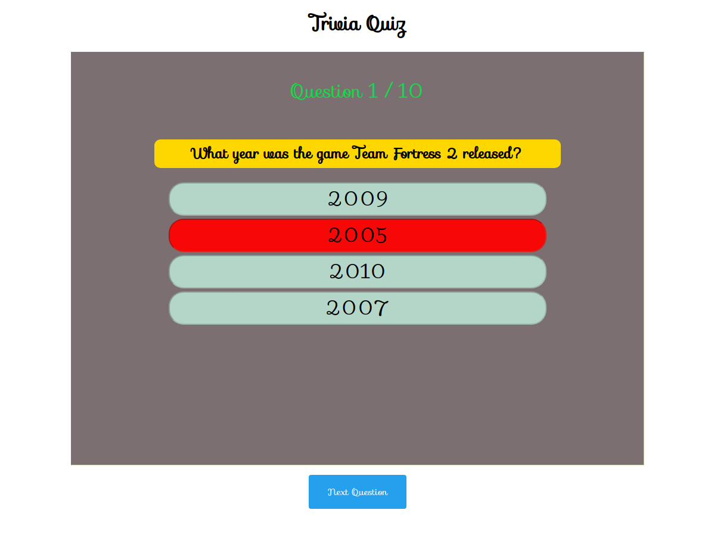
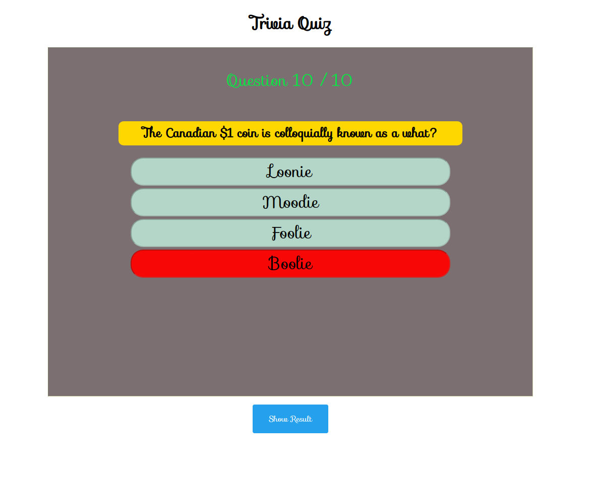

# Trivia Quiz Application (Version 2.0)

This is a simple React + TypeScript + Storybook application, it's a trivia quiz where the user answers a question and when all the questions are finished, they can see their score and the correct answers.

## Usage

First, you need to run `yarn install` or `npm install`, then you can lunch the application with `yarn run start`
or `npm run start`. To lunch storybook use `yarn run storybook` or `npm run storybook`

## The quiz

The quiz starts like this:

Clicking on "Start Quiz" will display the first question after lauding is finished, the "Next" button won't be shown unless an answer is chosen.

When you click on an answer, it will turn into red if it's wrong or to green if it's correct.

Wrong answer

Correct answer

After answering the final question, the "show Result" button will appear

Clicking the button will lead to the result table, this is where the user can see the score and a table displaying what was chosen as an answer as well as the correct result.

Clicking the "Start Quiz" button will restart the game.

## Storybook

Each component has a story, here is the card component story:

Before answering

Answer is correct

## Further Reading

If you want more explantion take a look at my website [React Trivia Quiz](https://ahmadhamze.github.io/posts/react/trivia-quiz/)
